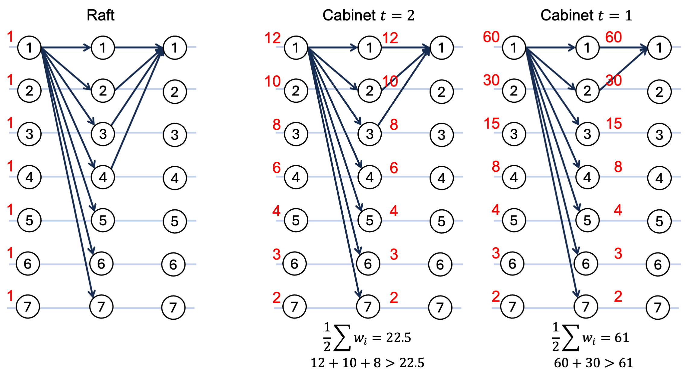

# Cabinet: Weighted Consensus Made Fast

## Cabinet in a Nutshell
Cabinet uses weighted consensus to achieve fast agreement. What sets it apart from Raft?
1. **Smaller quorum sizes** enabled by weighted consensus
2. **Customizable failure thresholds**, allowing the system to potentially tolerate more than half of the nodes failing.
3. **Dynamically adjusted weights** based on node responsiveness, helping the system maintain optimal performance.

## How Cabinet works?
Traditional consensus algorithms (such as Paxos and Raft) use majority quorums, which implicitly makes every node's decision weigh 1.

Cabinet assigns different weights to nodes, where a small group of fast nodes (i.e., cabinet members), can make a decision when their weights exceed the half of total weights, which reduces the size of the physical quorum.

### Example: 7-Node Cluster
Below is a visualization of three configurations in a 7-node setup:

- In **Raft**, all nodes are equal, each with an implicit weight of 1. A decision requires a majority (quorum size = 4). This setup tolerates 3 failures.

- In **Cabinet (t=2)**, a weight scheme (12, 10, ..., 3, 2) allows  fast consensus where the top three weighted nodes (cabinet members) agree (quorum size = 3). It tolerates **a minimum of 2 node failures** (any two among n1, n2, and n3) and **a maximum of 4 node failures** (the 4 lowest-weighted ones).

- In **Cabinet (t=1)**, a more skewed weight scheme (60, 30, ..., 3, 2) allows consensus when just the top two weighted nodes (cabinet members) agree (quorum size = 2). This set of weight scheme tolerates **a minimum of 1 node failure** (either n1 or n2 fails) and **a maximum of 5 node failures** (the 5 lowest-weighted ones).

Please refer to the paper for a more detailed description, including how weights are assigned, how weight schemes are calculated, how weights are dynamically adjusted for optimal performance, and our rigorous proofs of safety and liveness.

## Run Cabinet

### Compile
1. Make sure dependencies are installed. GoLang should have been properly installed with `GOPATH` and `GOROOT`. The GoLang version should be at least `go1.17.6`. In addition, three external packages were used (check out `go.mod`).

2. Download the code and go into the cabinet folder.
3. Build this project by `go build ../cabinet`, run the generated bin file.
4. Run `./cabinet -h` to check out the parameters.

### Configuration
Configuration files are named as `.conf` in the `config` folder. The columns are `serverID`, `IP`, and `port numbers`.

### Run a leader

### Run a follower

## Deployment

* Each server retrieves its IP and port using its serverID from `parameters.go`.
* To test Cabinet locally, set localhost as the IP and use different port numbers.

## Micobenchmark

Cabinet also proposes a benchmark framework tailored for distributed consensus applications, with a special focus on leader-based consensus algorithms (e.g., the Paxos/Raft family). This framework introduces a set of versatile and adaptable interfaces that seamlessly integrate existing benchmarks. In this repository, YCSB and TPC-C are integrated into the benchmark framework.

## Ratios of Operations/Transactions in YCSB and TPC-C Workloads

### YCSB Operations

| **YCSB op**       | **A** | **B**  | **C** | **D**  | **E**  | **F**  |
|--------------------|-------|--------|-------|--------|--------|--------|
| READ              | 0.5   | 0.95   | 1     | 0.95   |        | 0.5    |
| UPDATE            | 0.5   | 0.05   |       |        |        |        |
| SCAN              |       |        |       |        | 0.95   |        |
| INSERT            |       |        |       | 0.05   | 0.05   |        |
| ReadModifyWrite*  |       |        |       |        |        | 0.5    |

\* ReadModifyWrite consists of nested READs followed by UPDATEs on the same key.

### TPC-C Transactions

| **TPC-C tx**      | **Ratio** |
|--------------------|-----------|
| NEW_ORDER         | 0.45      |
| PAYMENT           | 0.43      |
| ORDER_STATUS      | 0.04      |
| DELIVERY          | 0.04      |
| STOCK_LEVEL       | 0.04      |
